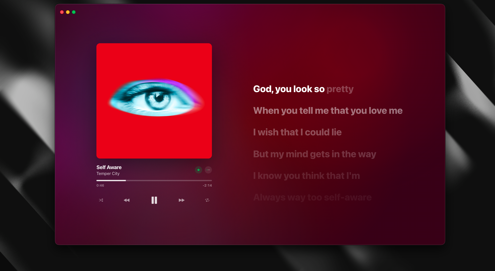

# Spicetify Lyrics Overlay

A full-screen lyrics overlay for Spotify with a polished Apple Music-inspired layout, synced lyrics support, animated backgrounds, karaoke mode, vinyl mode, and fast provider fallback through Spicetify.

<div align="center">
  
  <br/><br/>
  
  
</div>

## Why this exists

Spotify's built-in lyrics view is functional, but it does not feel immersive. This extension turns the current track into a large-format lyrics experience with stronger visual focus, richer motion, and direct playback controls.

## Features

- Full-screen lyrics overlay with artwork-first layout
- Synced lyrics playback with active line highlighting
- Karaoke mode for more aggressive line focus
- Vinyl mode with animated record styling
- Dynamic background colors based on the current cover art
- Built-in playback, like, progress, volume, and queue-aware controls
- Up Next preview inside the overlay
- Provider priority with fallback support
- Local lyrics cache for faster reloads on repeated tracks
- Retry action when no lyrics are returned

## Lyrics sources

- Spotify built-in lyrics
- LRCLIB synced lyrics via `syncedLyrics`

Plain unsynced LRCLIB text is intentionally ignored. The overlay prefers synchronized lyrics when available.

## Compatibility

The extension file itself does not need to be rewritten for macOS, Windows, or Linux.

Spicetify extensions are plain JavaScript files, and this project uses the same Spicetify APIs across platforms. What changes between operating systems is only:

- where the extension file is stored
- how your shell copy command looks
- the DevTools shortcut inside Spotify

If Spicetify works on your machine, this extension should work there too.

## Requirements

- Spotify desktop app
- Spicetify installed and working

Official Spicetify docs:

- https://spicetify.app/docs/development/extensions/

## Installation

### macOS / Linux

1. Copy the file into your Spicetify extensions folder.

```bash
cp spicetify-lyrics-overlay.js ~/.config/spicetify/Extensions/
```

2. Enable the extension.

```bash
spicetify config extensions spicetify-lyrics-overlay.js
spicetify apply
```

### Windows

1. Copy the file into your Spicetify extensions folder.

```powershell
Copy-Item .\spicetify-lyrics-overlay.js "$env:APPDATA\spicetify\Extensions\"
```

2. Enable the extension.

```powershell
spicetify config extensions spicetify-lyrics-overlay.js
spicetify apply
```

If you already use other Spicetify extensions, make sure `spicetify-lyrics-overlay.js` is added to your existing extension list instead of replacing it accidentally.

## Usage

- Open Spotify after applying Spicetify.
- Use the topbar button or floating button to open the overlay.
- Start a track with available synced lyrics.
- If no lyrics load, use `Retry lyrics lookup` in the empty state.
- Open the settings panel inside the overlay to change modes and provider priority.

## Settings

The overlay currently includes:

- Karaoke mode
- Vinyl mode
- Up Next preview
- Volume control
- Auto-hide lyrics when no lyrics are available
- Provider order for lyrics lookup

Settings are stored locally in Spicetify via browser storage.

## Troubleshooting

### Lyrics do not appear

- Run `spicetify apply` again
- Check whether the current track actually has synced lyrics
- Try `Retry lyrics lookup`
- Verify that external requests are not blocked by your local setup

### Extension does not load

- Confirm the file is inside the correct `Extensions` folder
- Confirm the filename in `spicetify config extensions` matches exactly
- Restart Spotify after applying changes

### Debugging

Open Spotify DevTools to inspect logs:

- macOS: `Cmd + Option + I`
- Windows / Linux: `Ctrl + Shift + I`

The extension also exposes `window.SpicetifyLyricsOverlay` for manual testing.

## Project structure

```text
.
├── assets/
│   ├── screenshot-1.png
│   ├── screenshot-2.png
│   └── screenshot-3.png
├── README.md
└── spicetify-lyrics-overlay.js
```

## Notes for publishing

If you make this repository public, the current structure is already fine for GitHub. You do not need a separate Windows or Linux build as long as the extension stays a single Spicetify JavaScript file.

If you want broader adoption later, the natural next step would be packaging it for the Spicetify Marketplace.

